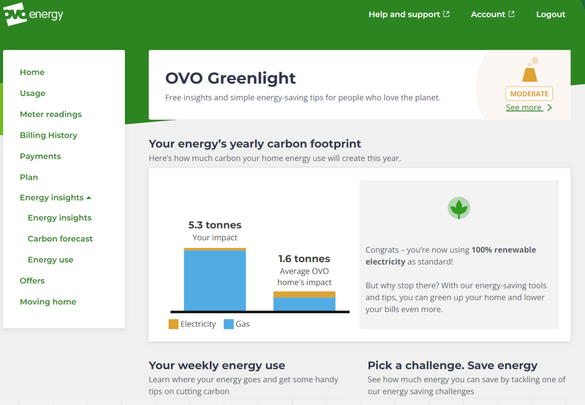

Welcome to our second post on inference and energy savings. [In our first post](https://tech.ovoenergy.com/inference-in-observational-studies/) you were introduced to the concept of inference, matching and pesky confounding variables - if you haven’t read our first post I would recommend you take a look. In this post we will go into detail about how we used a matching method called Coarsened Exact Matching (CEM) and an inference model to help determine if our energy saving insights were indeed helping customers save energy (spoilers: they do!).

```sql
SELECT `Custom_SQL_Query`.`Accounts` AS `Accounts`,
  `Custom_SQL_Query`.`COT_or_COS` AS `COT_or_COS`,
  `Custom_SQL_Query`.`Category` AS `Category`,
  `Custom_SQL_Query`.`Debt` AS `Debt`,
  `Custom_SQL_Query`.`Debt_Survival_Rate_12M` AS `Debt_Survival_Rate_12M`,
  `Custom_SQL_Query`.`Ledger_Segment` AS `Ledger_Segment`,
  `Custom_SQL_Query`.`Meter_Type` AS `Meter_Type`,
  `Custom_SQL_Query`.`Oldest_Debt_Category` AS `Oldest_Debt_Category`,
  `Custom_SQL_Query`.`Provision_12M` AS `Provision_12M`,
  `Custom_SQL_Query`.`Snapshot_Date` AS `Snapshot_Date`
FROM (
  SELECT  
  P.Snapshot_Date,
  TRIM(Ledger_Segment) as Ledger_Segment, 
  Oldest_Debt_Category, 
  CASE WHEN TRIM(Ledger_Segment) in ('Non-Performing DD','Performing DD') THEN 'Direct Debit'
       WHEN TRIM(Ledger_Segment) in ('Pay on Demand performing','Pay on Demand non-performing','Payment Plan','VOID/Occupier') THEN 'Pay on Demand'
       WHEN TRIM(Ledger_Segment) in ('Final VOID/Occupier','Final Pay on Demand','Final DD') THEN 'Final'
       ELSE 'PAYG'END AS Category,
  SUM(Debt) AS Debt, 
  Debt_Survival_Rate_12M, 
  SUM(Provision_12M) AS Provision_12M,
  CASE WHEN AH.Meter_Type_Category = 'Dumb' THEN 'Trad' WHEN AH.Meter_Type_Category = 'Smart and Dumb' then 'Both' 
       WHEN AH.Meter_Type_Category is null THEN 'Unknown' else AH.Meter_Type_Category END as Meter_Type,
  CASE WHEN AH.Switch_Type = 'S' THEN 'COS' WHEN AH.Switch_Type = 'M' THEN 'COT' ELSE 'Unknown' END as COT_or_COS,
  COUNT(*) AS Accounts
  FROM `data-science-retail.bad_debt_provision.Provision_By_Account` P
  left join `ovo-dwh-prod.crm.account_history` as AH on AH.Account_No = P.Account_No and AH.Snapshot_Date = P.Snapshot_Date and AH.Snapshot_Date>= '2020-07-31'
  GROUP BY 1,2,3,4,6,8,9
) `Custom_SQL_Query`
```

## Why all the Hassle?!

So let me set the scene… My team works on a section of the website called OVO Greenlight. The aim of Greenlight is to be a one stop shop for anything carbon reduction (mainly surrounding your energy usage) and as such the page contains details about a customer's energy carbon footprint as well as tips, tricks and actions to reduce the footprint. If you are an OVO customer then go take a look! It’s pretty sweet stuff - if we do say so ourselves!


## Lofty Goals …


As discussed in the previous post, when assessing the impact of a product or feature the gold standard is a randomised control trial, often in the form of an A/B test where each person is randomly assigned to either the control or treatment group. However, in some cases this isn’t possible.

For example if we were interested in testing whether smoking increases the risk of lung cancer, we wouldn’t separate people into a control and treatment group and ask those in the control to never smoke and ask those in the treatment to smoke a pack a day! This is where observational studies can help - when the intervention is out of the researchers control. Anyway, I won’t go into any more detail here as the first post does a great job at explaining.

Needless to say, this is where we found ourselves: with a set of pages with energy saving tips and actions, available to everyone at OVO. We had a binary intervention variable (some people viewed the pages and others did not), and wanted to understand if the intervention (the first viewing of our pages) was indeed helping people save energy.

## Method to the madness


As a light reminder from the previous post, one way of conducting an observational study is using a 2-step process:

The matching step: where we match customers who received the intervention (viewed the page for the first time) with those who didn't to control for any confounding variables. Thus we create one group for people who viewed the page and a pseudo-control group that we treat as the "counterfactual" of the treatment group (people who didn't view the page).
The inference step: where we build a model to predict the outcome of interest (in this case energy usage) including the intervention variable (whether a customer viewed the page) in the model.

## And that’s a match

Customers who viewed the Greenlight pages (labelled “actuals” in this post) were matched to customers who did not view the page (labelled “counterfactuals” in this post) based on a number of variables (shown below). The matching step aims to control for any confounding variables - variables which impact both the outcome and treatment. By controlling for these confounding variables we are trying to replicate/mimic a randomised controlled trial.


:::table{caption="Variables used in matching" colorScheme=blue size=lg variant=striped}
| City        | County | 
| ----------- | ------ | 
| Length of time at Ovo       | Tariff Type  |
| Length of time with Smart Meter       | Has multi-rate tariff?  | 
| Estimated Yearly Consumpton    | Has OVO Beyond product  |
| Avg termperature over last month  | Tenancy Type |
| Mexico City | Mexico |
:::

As an example of a confounding variable: in our case it may be that typically younger customers use our website more and thus are more likely to view our Greenlight page (an outdated stereotype but it does well to illustrate the point). Younger people may also be more or less likely to try and save energy. As such we need to ensure that we control for age (if we can) to make sure the results are not biased by this potential confounding variable (which impacts both the likelihood of viewing the Greenlight pages and energy usage habits/consumption). As it happens controlling for the customer age did not impact the results and was therefore not used in the matching.

Of course we do not know which variables will be confounding variables so we must use our domain knowledge as well as advice from other experts to decide which variables may influence both the Greenlight page visit and energy savings. Variables considered included demographic, energy specific variables (such as previous usage and temperature) and socio-economic variables.

For this project we used Coarsened Exact Matching to match our customers (see previous post for more details) which coarsens the variables for the matching process. You could imagine matching customers based on their exact age in years and months would result in very few matches but matching based on their age bucketed to the nearest 5 years would result in many more matches. The amount of coarsening requires experimentation and includes a degree of subjectivity. It is worth noting that many other matching methods do exist.

## Fixing Windows - Inference

For the inference step the aim is to build a linear regression model which predicts the variable we are interested in - the energy consumption for a customer over a fixed window of time after viewing the pages. We can then include the intervention variable (whether the customer viewed the Greenlight pages) in the model and interpret the coefficient of this variable as the impact of the intervention. The same variables from the matching were also used in the model (without the coarsening).

In our case the model aimed to predict the sum of the next 90 days of consumption after the point of first viewing the page. When choosing this fixed window size we needed to balance the time for a customer to actually start taking an action and the amount of data available. The page had only been live for 9 months at time of analysis so a 9 month window would have severely limited the number of customers in the analysis. We ultimately chose a fixed window of 90 days.

## Show me those savings!

Finally we come to the results! The plot below shows the energy saved by customers after viewing Greenlight. The assessment was conducted for any Greenlight page views after the launch in April 2021. As such we only include about 6 months of data which does not include a full winter.


We can see that there was a notable 2.3% reduction to Gas energy usage after viewing the Greenlight pages based on the medium TDCV energy user. We do also see a slight increase in energy usage for electricity. This is somewhat unexpected but we can see that the confidence interval forms a much larger proportion of the change than in the gas case. There are possible explanations for this such as increased uptake of electric vehicles and electric heating amongst the Greenlight viewers, but this is not substantiated or investigated as part of this analysis. It will be very interesting to check back in on these results in a few months when we have a complete year of data.

It is very encouraging to see that there is a true impact of the Greenlight pages on energy usage, particularly for Gas usage which has a much higher carbon footprint than electricity at OVO since OVO's electricity is backed by renewable certificates. We will be keeping an eye on these results and reassessing once we have a full year of data but the initial findings seem promising. We are also keen to assess the impact of multiple viewings of the page - watch this space!

